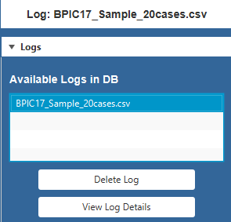
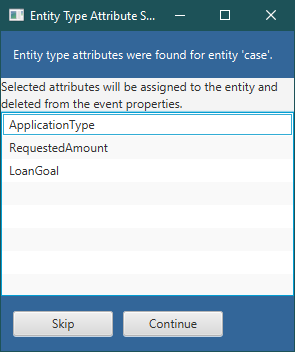
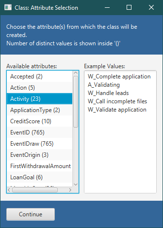
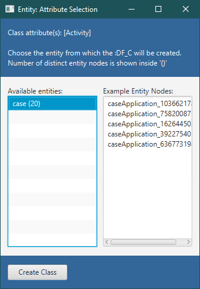
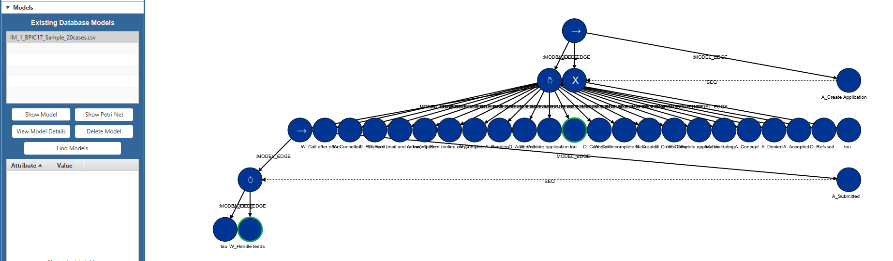
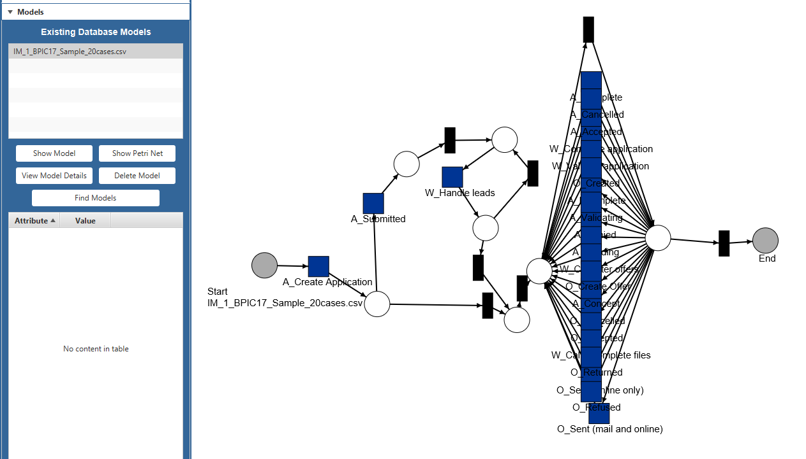

# Process Mining Tool for Event Graphs

This repository contains the Java project for a Process Mining tool that works on top of an Event Graph Database.

## Specifications

- IDE: IntelliJ IDEA 2020.2.4 (Ultimate Edition)
- Java:
    - jdk-13.0.1
    - java version "13.0.1" 2019-10-15
    - Java(TM) SE Runtime Environment (build 13.0.1+9)
    - Java HotSpot(TM) 64-Bit Server VM (build 13.0.1+9, mixed mode, sharing)
 - Neo4j:
    - Version: 4.4.2
    - Edition: Community

## Requirements

In order to run this project, please ensure access to a running Neo4j 4.4.2 database, with the GDS and APOC libraries installed. 
To the database settings file, add the line `cypher.lenient_create_relationship = true`.

## How to Run

In this section we provide the instructions on how to run the project using IntelliJ IDEA 2019.3.3.

### Update parameters
1. Open the _"Utils.java"_ file located on the following path: _"src\EventGraphs\"_ (starting from the main project folder).

2. Update following parameters:
<!--     - **NEO4J_BAT_PATH**
    This path, specified in line 20 of the _"Utils.java"_ file, is used to run the start command on Neo4j and enable the remote interface (available at http://localhost:7474/).
    If using Neo4j Desktop, 
     -->
    
- **NEO4J_IMPORT_PATH**
This path, specified in line 21 of the _"Utils.java"_ file, is used to indicate the Neo4j Import folder, where the CSV files must be placed to be imported into the graph database.

- Also in the _"Utils.java"_ file, in lines 25 and 26, update the **DEFAULT_USER** and **DEFAULT_PASS** parameters if necessary.

### Setup the Run Configuration

The main class of the application is the _"EventGraphs.java"_ file, located in _"src\EventGraphs\"_. The steps to run the project from IntelliJ are shown next:

1. Go to _Run_ -> _Edit Configurations_
    
    
    
2. On the window that appears, in the top-left corner, click on the _"+"_ sign to add a new "Application" configuration.
    
    

3. Set the following parameters:
    - Main class: EventGraphs.EventGraphs
    - VM options*:
        
        `--module-path "C:\Java\javafx-sdk-15.0.1\lib" --add-modules javafx.controls,javafx.fxml`
     
        *The JavaFX-SDK path may be different. For example, another valid path could be: _"C:\Java\javafx-sdk-11.0.2\lib"_
    
4. The final Configuration should look similar to this:
    
    
    
5. Clicking on the "Play" button should get the application started.
    
    
    
6. If Neo4j has already been started, the following window will appear:
    
    

    Otherwise, the application will attempt to start Neo4j on the background and the window will show a different message when this is completed.
    
7. If the Neo4j connection could be confirmed, closing the _"Neo4j Connection Status"_ window will lead to the main window of the application.

## Usage Example

### Importing the Data

1. Place the _"BPIC17_Sample_20cases.csv"_ file in the **NEO4J_IMPORT_PATH** specified during the Run Configuration.
2. In the user interface, go to _File_ -> _Upload CSV File_
    1. Choose the _"BPIC17_Sample_20cases.csv"_ file
    2. Choose "Activity" as the _"Activity"_ attribute and click on Continue.
    
        
    
    3. On the next window, choose all the attributes from the list (using Ctrl + click), anc click Finish.
    
        
    
    
3.	On the _"Logs"_ panel on the left of the user interface, select the recently uploaded log so its name appears on the top label.

    
    
4. Go to the _"Graph Data"_ panel and click on the Instance Level "View" button to visualize the Event nodes.
    1. Use the Mouse Scroll to zoom in or out of the Graph panel.
    2. Drag the mouse while pressing the Right Click to move around the Graph panel.
    
    
    
### Creating Entities and Classes

1. On the _"Entities"_ panel, click on "New Entity".

2. On the window that appears, select the "case" attribute and click on Create Entity.

    

3. If the "Entity Type Attribute Selection" window appears, click on Skip.

    

4. On the _"Classes"_ panel, click on "New Class".

5. On the window that appears, select the "Activity" attribute and click on Continue.

    

6. On the next window, select the "case" entity and click on Create Class.

    

### Creating a Model

1. On the _"Algorithms"_ panel, select "Inductive Miner" from the dropdown menu and click on Generate Model.

2. On the window that appears, do the following:
    1. Make sure that the Class Type is "Activity".
    2. Make sure that the Entity Type is "case".
    3. Select "DFG" as the splitting type
    4. Click on Generate Model.
    
    

3. To visualize the model, go to the _"Models"_ panel, select the recently generated model (whose name should be "IM_1_BPIC17_Sample_20cases.csv") and click on Show Model.

    

4. To visualize the Petri net that represents that model, select the "IM_1_BPIC17_Sample_20cases.csv" model and click on Show Petri Net.

    

## Additional Notes

- The input file used for the Python script _"bpic17_prepare.py"_, which generates the data subsets included in the _"evaluation/"_ folder of this repository, can be found in the [website](https://doi.org/10.4121/uuid:5f3067df-f10b-45da-b98b-86ae4c7a310b) of the BPI Challenge 2017.
- The graph visualizations used for this project were configured with the help of the GraphStream JavaFX Viewer library. For more information on this java library, visit the website <http://www.graphstream-project.org/>
